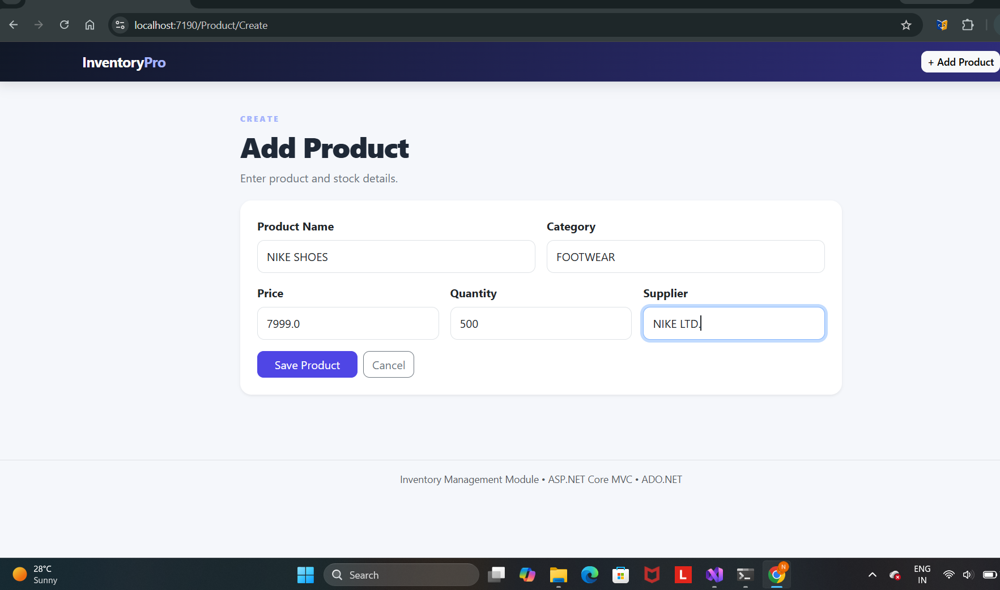
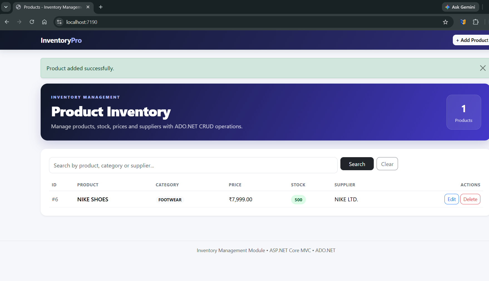
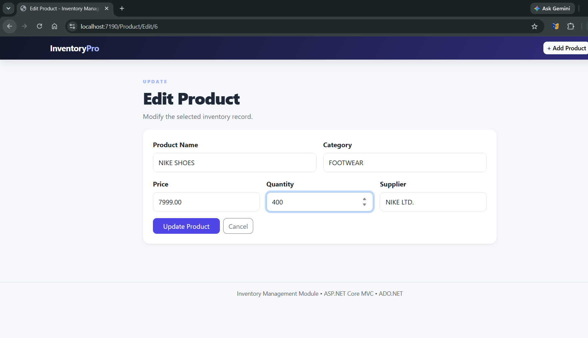
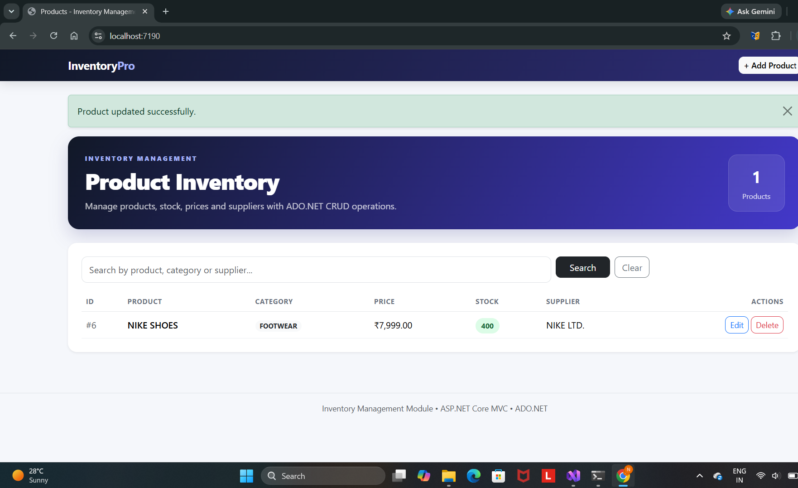
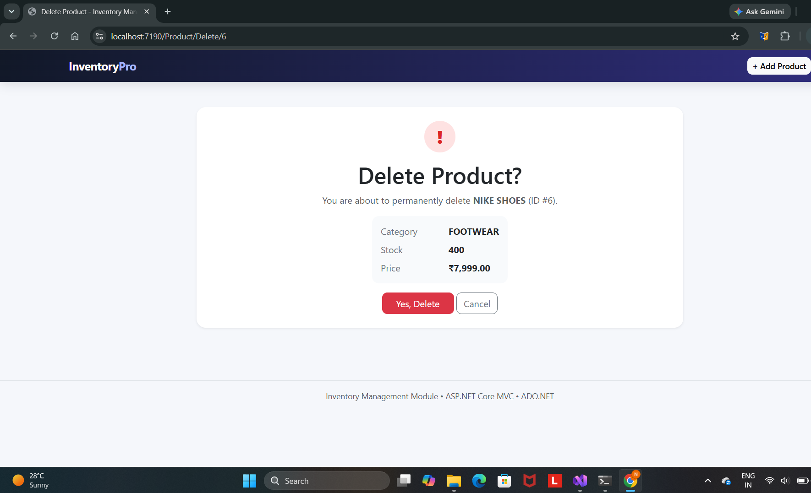
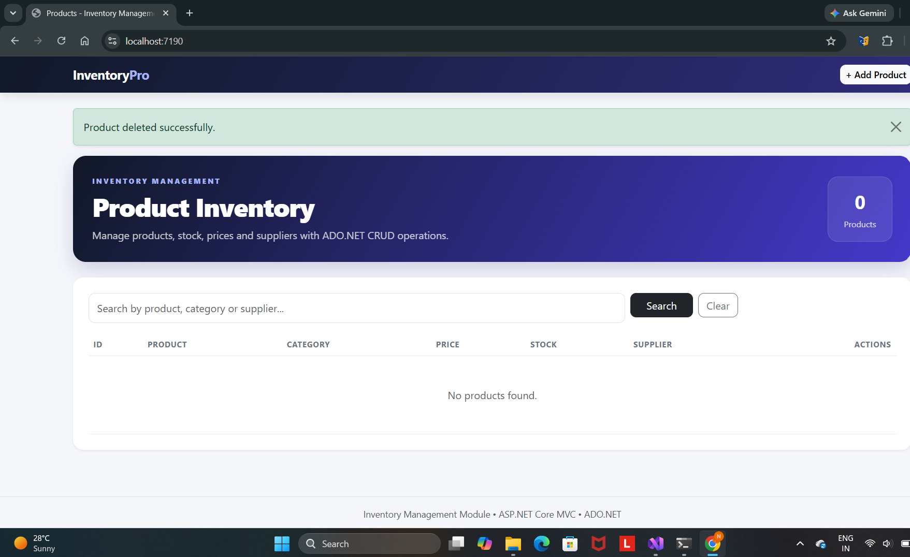

# Inventory Management Module using ADO.NET & CRUD Operations

An ASP.NET Core MVC (.NET 10) web application that manages product inventory in a **SQL Server** database using **ADO.NET** (`SqlConnection`, `SqlCommand`, `SqlDataReader`) with full **CRUD** operations and search.

## Features
- Create, Read, Update and Delete products
- Search by product name, category or supplier
- Stock badges (good / low / out of stock)
- Parameterised queries (protection against SQL injection)
- Server-side validation with data annotations

## Project structure
| Folder / file | Purpose |
|---|---|
| `1_Database/01_CreateDatabase.sql` | Database creation (`InventoryDB`) |
| `1_Database/02_CreateTables.sql` | `Products` table + sample data |
| `1_Database/03_TableQueries.sql` | INSERT / SELECT / UPDATE / DELETE / report queries |
| `2_Connection/` | `DbConnection.cs`, `appsettings.json`, `ConnectionStrings.txt` |
| `3_CRUD/` | `Product.cs` (model), `ProductRepository.cs` (ADO.NET CRUD) |
| `Controllers/`, `Views/`, `wwwroot/` | MVC controller, Razor views, styles |
| `screenshots/` | Application output |

## Getting started
**Requirements:** Visual Studio 2022 or newer, .NET 10 SDK, SQL Server LocalDB (installed with Visual Studio).

1. Open **SQL Server Object Explorer** > `(localdb)\MSSQLLocalDB` > right-click > **New Query**.
2. Run `1_Database/01_CreateDatabase.sql`, then `1_Database/02_CreateTables.sql`.
   (`02_CreateTables.sql` drops and recreates `dbo.Products`, then inserts 5 sample rows.)
3. Check the connection string in `appsettings.json` (other options in `2_Connection/ConnectionStrings.txt`).
4. Open `InventoryManagement.sln` and press **Ctrl+F5**. The app opens at `https://localhost:7190`.

Using another SDK? Change `<TargetFramework>` in `InventoryManagement.csproj` (for example `net8.0`).

## Screenshots
| Add product | Product added |
|---|---|
|  |  |

| Edit product | Product updated |
|---|---|
|  |  |

| Delete product | Product deleted |
|---|---|
|  |  |

## Technology
ASP.NET Core MVC, ADO.NET (`Microsoft.Data.SqlClient`), SQL Server / LocalDB, Razor Views, Bootstrap 5.
